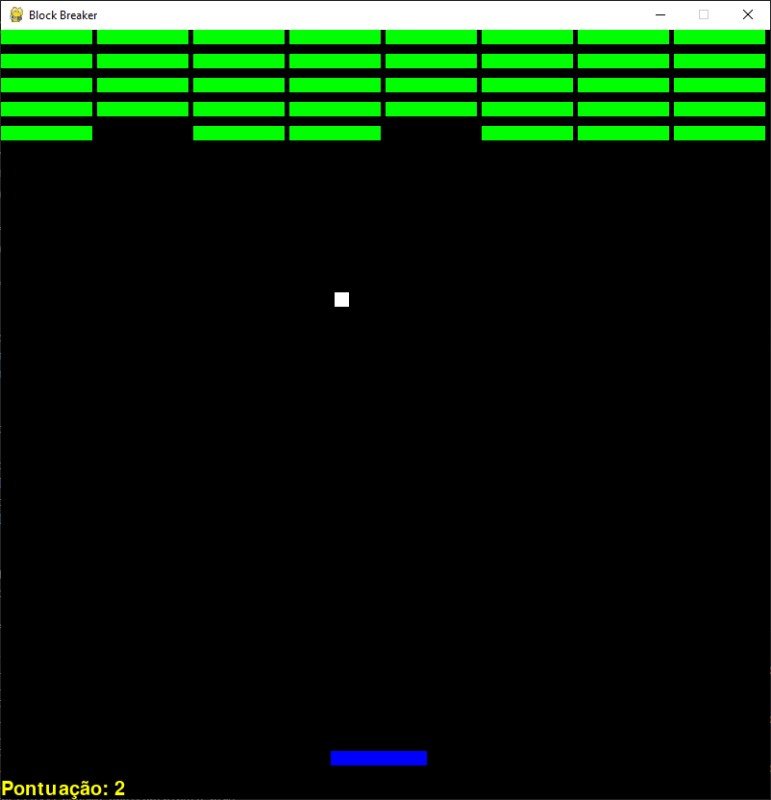

# Block Breaker



> Um jogo estilo Breakout onde o jogador controla uma barrinha para rebater uma bola e quebrar blocos. Inspirado nos clássicos de quebra-blocos, este jogo foi criado usando Python e a biblioteca Pygame.


### Download do Jogo

Clique [aqui](https://github.com/DennerCaleare/Game_BlockBreaker/blob/main/Executavel/jogo.exe) para baixar o arquivo `jogo.exe`. Teste avontade! 😀


### Ajustes e melhorias

O projeto ainda está em desenvolvimento e as próximas atualizações incluirão:

- [x] Adicionar placar de pontuação
- [x] Ajuste de velocidade da bola
- [ ] Animações de quebra de bloco
- [ ] Efeitos sonoros e música de fundo
- [ ] Níveis de dificuldade

## 💻 Pré-requisitos

Antes de começar, verifique se você atendeu aos seguintes requisitos:

- Python 3.x instalado em sua máquina
- Biblioteca Pygame instalada
- Compatível com sistemas Windows, macOS e Linux

## 🚀 Instalando Block Breaker

Para instalar o Block Breaker, siga estas etapas:

### Linux e macOS:

```bash
pip install pygame
```

### Windows:

```bash
pip install pygame
```

## ☕ Usando Block Breaker

Para iniciar o Block Breaker, execute o arquivo principal do projeto:

```bash
python jogo.py
```

Mova a barrinha para a direita ou esquerda usando as setas do teclado e evite que a bola caia para quebrar todos os blocos!

## 📫 Contribuindo para Block Breaker

Para contribuir com Block Breaker, siga estas etapas:

1. Bifurque este repositório.
2. Crie um branch: `git checkout -b <nome_branch>`.
3. Faça suas alterações e confirme-as: `git commit -m '<mensagem_commit>'`
4. Envie para o branch original: `git push origin block-breaker/<local>`
5. Crie a solicitação de pull.

Para mais detalhes, consulte [como criar uma solicitação pull](https://help.github.com/en/github/collaborating-with-issues-and-pull-requests/creating-a-pull-request).

### Linux e macOS:

```bash
pip install pygame
```

### Windows:

```bash
pip install pygame
```

## ☕ Usando Block Breaker

Para iniciar o Block Breaker, execute o arquivo principal do projeto:

```bash
python jogo.py
```

Mova a barrinha para a direita ou esquerda usando as setas do teclado e evite que a bola caia para quebrar todos os blocos!

## 📫 Contribuindo para Block Breaker

Para contribuir com Block Breaker, siga estas etapas:

1. Bifurque este repositório.
2. Crie um branch: `git checkout -b <nome_branch>`.
3. Faça suas alterações e confirme-as: `git commit -m '<mensagem_commit>'`
4. Envie para o branch original: `git push origin block-breaker/<local>`
5. Crie a solicitação de pull.

Para mais detalhes, consulte [como criar uma solicitação pull](https://help.github.com/en/github/collaborating-with-issues-and-pull-requests/creating-a-pull-request).
